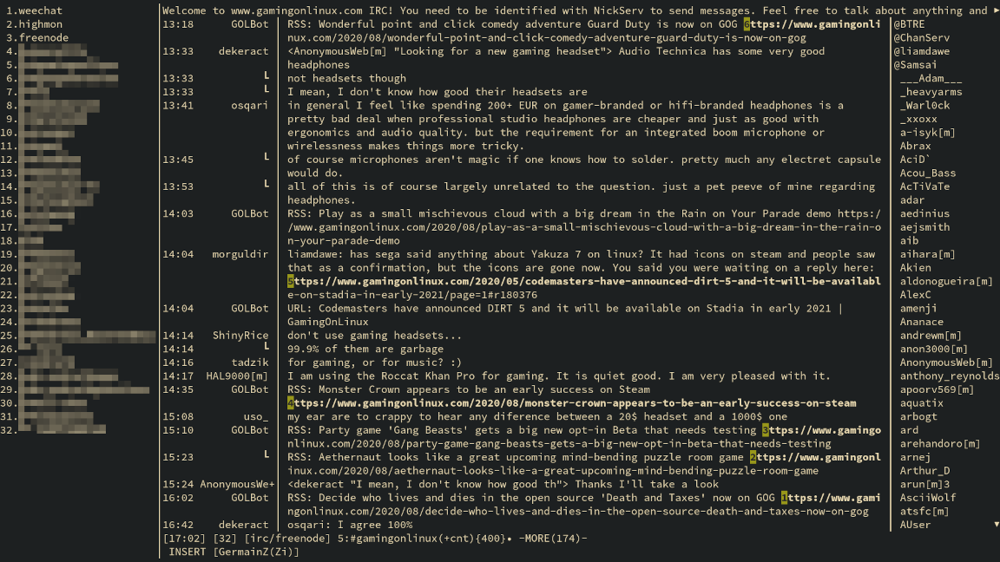
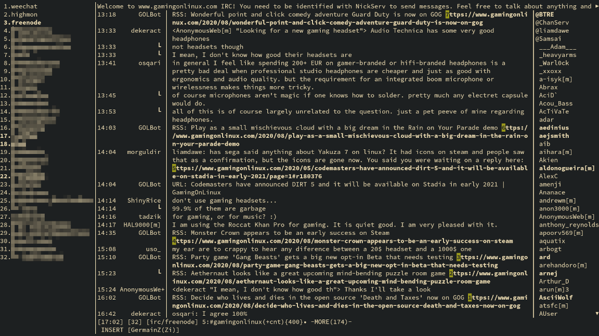

Description
===========

A [kitty](https://sw.kovidgoyal.net/kitty/) kitten that aims to act like the
[native URL hints kitten](https://sw.kovidgoyal.net/kitty/kittens/hints.html)
(bound to `ctrl+shift+e` by default), while supporting WeeChat's line wrapping
for URLs.  The goal is to be able to use URL hints directly without having to
go into WeeChat's raw mode (bound to `meta+l` by default) first.

Screenshots
===========

**Before:** using kitty's native URL hints kitten, wrapped URLs are not
detected/opened correctly.  

**After:** using this script, wrapped URLs are detected/opened correctly.

Usage instructions
==================

In WeeChat, `weechat.look.prefix_suffix` and `weechat.look.separator_vertical`
must be set to the same value. Additionally, the `SEPARATOR` variable (first
line in the script) must be updated to reflect that value.

Download and place the script (`weechat-hints.py`) in the ~/.config/kitty/
directory, for example:

    cd ~/.config/kitty/
    wget 'https://github.com/GermainZ/kitty-weechat-hints/raw/master/weechat-hints.py'

Once that is done, kitty must be launched as such: `kitty -o 'map
kitty_mod+e kitten hints --customize-processing weechat-hints.py' weechat`.

The shortcut can be customized, for example `map f1` can be used instead to
keep the original kitten intact as a backup, and make the WeeChat-aware one
available by pressing the `F1` key.

Notes
=====

The script has to make certain assumptions, and may not work correctly if your
WeeChat layout is vastly different or for specific messages. It should,
however, provide a starting point that you can adapt.
